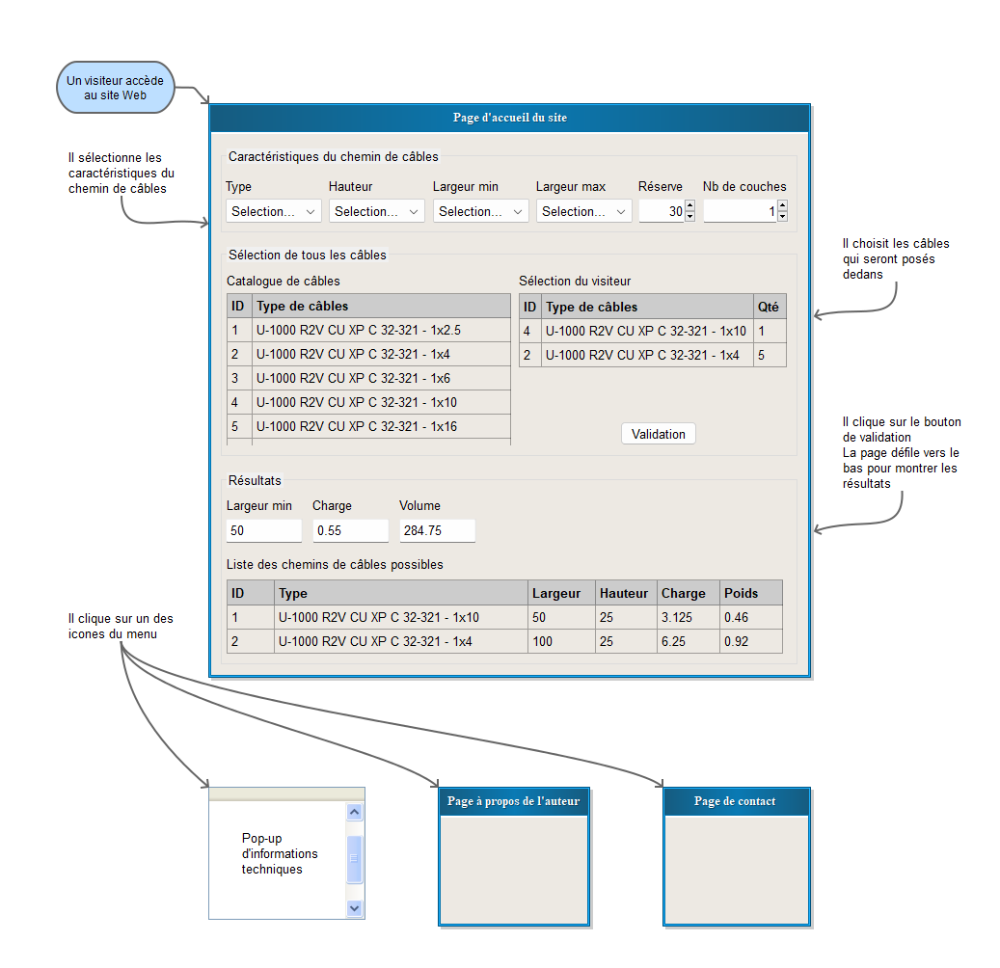
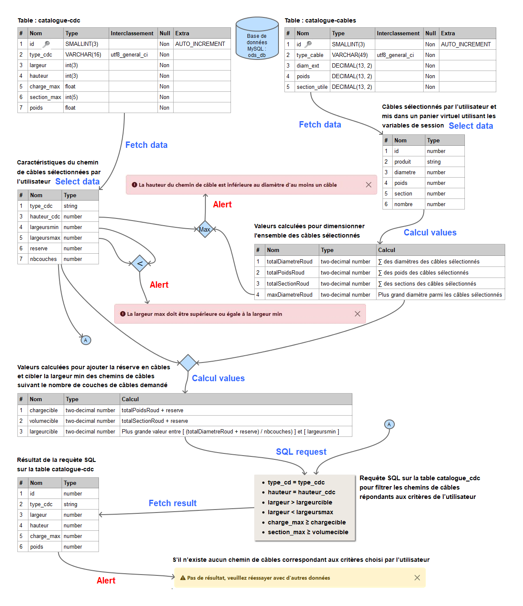

# <p align="center" >CTS - Cable Tray Sizing</p>

_Préambule : CTS est un site de démonstration qui a permis à son auteur d'apprendre à concevoir et à développer un site web._

<p>CTS est un outil en ligne de pré-dimensionnement des chemins de câbles utilisable pour tout projet industriel ou tertiaire. Lors de la conception d'installation de systèmes de chemins de câbles au sein d'un bâtiment, le dimensionnement raisonnable de ces systèmes est très souvent négligé. La conséquence au terme des travaux et au moment de transmettre l'installation au client final est d'avoir conçu des chemins de câbles trop large pour seulement quelques câbles supportés ou trop petit et débordant de câbles.</p>
<p>CTS a été conçu pour déterminer le système de chemin de câbles optimum en fonction des critères techniques que l'utilisateur choisi. Pour cela, CTS se base sur des catalogues normalisés, un de chemins de câbles et un autre de câbles et fourni des résultats conformes à la norme DIN VDE 0639.</p>

## 👀 Interface utilisateur

<p>CTS facilite la navigation de l'utilisateur au sein du site. Le site possède trois pages html uniquement. Une page principale d'accueil sur laquelle l'utilisateur va pouvoir réaliser en ligne le pré-dimensionnement de ses chemins de câbles. A partir ce cette page principale, l'utilisateur a accès à une page de contact et à une autre page sur l'auteur.</p>



## 🧠 Traitement et flux des données

<p>L'application a été développé sur la base d'un logigramme de conception identifiant les flux de données, les interactions avec l'utilisateur et les algorithmes de calculs nécessaires au bon fonctionnement de cet outil en ligne.</p>



## 🤖 Technologie Employée

- [Bootstrap 5](https://getbootstrap.com/)
- [plug-in jQuery DataTables](https://datatables.net/)
- [plug-in jQuery Tabledit](https://github.com/markcell/jQuery-Tabledit/)
- [Google reCAPTCHA](https://www.google.com/recaptcha/about/)

## 🛠️ Installation

### Les étapes de mise en production du site de démonstration CTS

1. Importer la base de données CTS dans la base de données mysql de l'hébergeur
2. Télécharger tous les répertoires et les fichiers de l’application CTS sur l’espace de stockage de l'hébergeur
3. Modifier les fichiers suivants :

   1. connect.php avec les paramètres de connexion à la bdd

      ```
       new Database("servername", "databasename", "username", "password")
      ```

   2. contact.html en intégrant la clé du site donnée par Google reCAPTCHA

      ```
      data-sitekey="6Lxxxxxxxxxxxxxxxxxxxxxxxxxxxxxxx"
      ```

   3. mail.php en intégrant :

      1. La clé secrète donnée par Google reCAPTCHA

         ```
          $recaptcha = new \ReCaptcha\ReCaptcha("6Lxxxxxxxxxxxxxxxxxxxxxxxxxxxxxxx")
         ```

      2. Le nom du site

         ```
          $resp = $recaptcha->setExpectedHostname('domainname')
         ```

      3. L’adresse de la boite mail

         ```
          $to = "your@email.com"
         ```

## 🕹️ Démo

- [Application CTS](https://cfarin.ovh/)

## 🤓 Auteur

#### Christophe Farin

- [linkedin](https://www.linkedin.com/in/christophe-farin-564b2132/)
